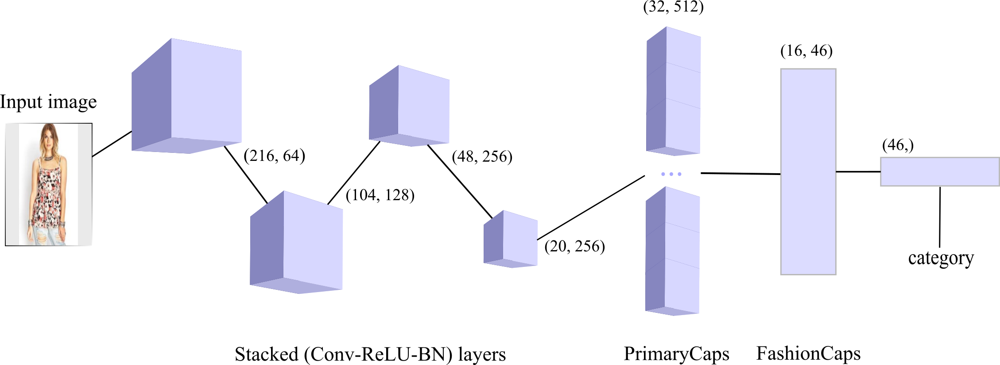
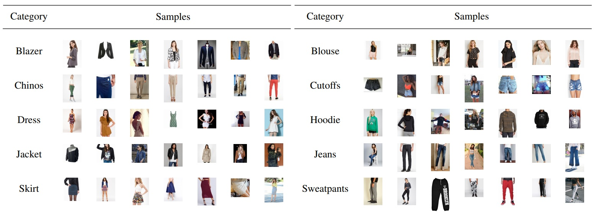
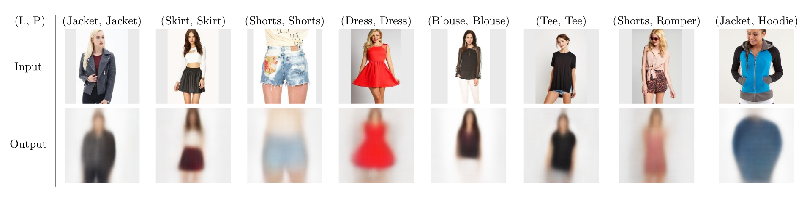

# FashionCapsNet
Clothing Classification with Capsule Networks


## Project Details
Keras (Backend: TF) implementation of FashionCapsNet

Submitted to [Turkish Journal of Electrical Engineering & Computer Sciences](https://journals.tubitak.gov.tr/elektrik/index.htm).
Paper will be released soon!

Reference:
[Sara Sabour, Nicholas Frosst, Geoffrey E Hinton. Dynamic Routing Between Capsules. NIPS 2017](https://arxiv.org/abs/1710.09829)

Base code for Capsule architecture:
[XifengGuo](https://github.com/XifengGuo/CapsNet-Keras)

Dataset: [DeepFashion](http://mmlab.ie.cuhk.edu.hk/projects/DeepFashion.html) 
contains 290K training, 40K validation and 40K test images with 46 fine-grained category labels for clothing images


## Contacts
Please feel free to open an issue or to send an e-mail to `furkan.kinli@ozyegin.edu.tr`

## Dependencies
* NumPy 1.16.X
* Tensorflow 1.12.X
* Keras 2.2.X
* OpenCV 3.4.X

## Training
```
python main.py --args
```

Validation accuracy converges at 255. epoch.

Apprx. 15 days to complete train on 2 GTX1080Tis.

For running with different parameters, please view the config file!

## Testing
```
python main.py -t -w ./result/t_model.h5
```

## Results
Test accuracy:
* Top-1: 63.61%
* Top-3: 83.18%
* Top-5: 89.83%

## Reconstruction

